# ITCC 41 - Multi-Page Student Profile

## Activity 2

A basic student profile created using **HTML and CSS** and bundled with **Apache Cordova** for Android.

### Student Information

**Name:** Luic Villamin
**Course:** Bachelor of Science in Information Technology (BSIT)
**Subject:** ITCC 41 - Mobile Application Development
**Activity:** Activity 2 - Basic Student Profile
**Year:** 2026

---

## Activity 2 - About the Project

This project is a basic student profile developed using HTML and CSS. It contains an About section, Skills section, Contact section, navigation menu, profile picture, and footer.

The profile was bundled and compiled using Apache Cordova and successfully run using an Android emulator.

### Technologies Used

* HTML
* CSS
* Apache Cordova
* Android SDK
* Gradle
* Android Emulator

---

## Activity 2 - Student Profile Screenshots

### Screenshot 1 - Student Profile


### Screenshot 2 - About Section


### Screenshot 3 - Interests and Educational Background


### Screenshot 4 - Goals and Skills


### Screenshot 5 - Contact Section


### Screenshot 6 - Android Emulator


---

## Activity 2 - Conclusion

The Basic Student Profile was successfully created using HTML and CSS, bundled and compiled using Apache Cordova, and run successfully using an Android emulator.

© 2026 Luic Villamin. All Rights Reserved.

---

# Activity 3 - Responsive Student Profile

## About the Project

This project is an improved version of my Activity 2 Student Profile. It was redesigned using responsive web design and basic UI/UX principles to make the profile easier to view and use on desktop, tablet, and mobile screen sizes.

The profile uses HTML and CSS and is bundled with Apache Cordova for Android. The layout automatically adjusts to different screen sizes without horizontal scrolling or overlapping content.

## Responsive Design Techniques

The following responsive design techniques were used:

* Flexible section widths using percentages and a maximum width.
* CSS media queries for tablet and mobile screen sizes.
* Responsive typography using `clamp()`.
* Responsive spacing and padding using `clamp()`.
* A flexible navigation menu that can wrap on smaller screens.
* A responsive skill grid that changes from two columns to one column on mobile.
* Responsive images that do not exceed their container width.
* Text wrapping to prevent long content from causing horizontal scrolling.

## UI/UX Principles

The profile was designed with the following UI/UX principles:

* **Consistency:** Colors, card styles, spacing, and typography are kept consistent throughout the page.
* **Visual Hierarchy:** Headings, profile information, sections, and cards are organized to make important information easy to notice.
* **Accessibility:** Navigation links have clear focus styles, and navigation buttons have comfortable touch targets.
* **Readability:** Appropriate font sizes, line spacing, and content widths are used to make the text easier to read.
* **Responsive Design:** The layout adapts to desktop, tablet, and mobile screen sizes.
* **Usability:** The navigation links allow users to quickly move between the different sections of the profile.

## Navigation

The profile uses HTML anchor links to navigate between sections of the profile.

The navigation was created using HTML anchor links and does not require JavaScript.

## Project Structure

```text
Villamin_Profile/
├── www/
│   ├── css/
│   │   └── index.css
│   ├── img/
│   │   ├── IDPhoto_20210719_005457 (1)-Photoroom.png-Photoroom.png
│   │   └── logo.png
│   ├── js/
│   └── index.html
├── screenshots/
├── config.xml
├── package.json
└── README.md
```

## How to Run

1. Open the project folder in a code editor such as Notepad++ or Visual Studio Code.
2. Open `www/index.html` in a web browser to view the responsive student profile.
3. For the Android version, use Apache Cordova to build and run the project on an Android emulator or compatible device.

## Activity 3 Screenshots

The following screenshots show the responsive Student Profile on desktop, laptop, tablet, and mobile screen sizes.

### Screenshot 1 - Desktop View


### Screenshot 2 - Laptop View (1024px)


### Screenshot 3 - Mobile View (320px)


### Screenshot 4 - Mobile View (425px)


### Screenshot 5 - Tablet View (768px)


---

## Activity 3 - Conclusion

The Student Profile was improved using responsive web design and UI/UX principles. The layout was tested on desktop, laptop, tablet, and mobile screen sizes to ensure that the content remains readable, usable, and properly arranged without horizontal scrolling or overlapping elements.

---

# Activity 4 - Multi-Page Student Profile

## About the Project

Activity 4 continues the existing Student Profile project by converting it into a multi-page website. The project contains five separate HTML pages that provide information about me, my skills, my projects, and my contact information.

The project continues to use **HTML and CSS** and is bundled with **Apache Cordova** so that it can run on an Android emulator.

## Application Pages

The Student Profile contains five pages:

### 1. Profile

The Profile page is the homepage of the application. It contains my profile picture, complete name, short introduction, brief description, and navigation links to the other pages.

### 2. About

The About page provides information about me, including my personal introduction, interests, educational background, and goals.

### 3. Skills

The Skills page lists my skills and provides a short description of each skill.

The five skills included are:

* HTML
* CSS
* Java Programming
* Problem Solving
* Computer Skills

### 4. Projects

The Projects page presents three projects and activities:

* **Student Profile Website**
* **Java Programming Activities**
* **Cordova Mobile Application**

Each project includes a short description, my role or contribution, and the technologies or tools used.

### 5. Contact

The Contact page provides my name, email address, course, GitHub profile, and professional profile information.

## Navigation

The application uses normal HTML anchor links to connect the five separate pages.

The navigation menu is available consistently across the pages:

* `index.html` - Profile
* `about.html` - About
* `skills.html` - Skills
* `projects.html` - Projects
* `contact.html` - Contact

Users can move between Profile, About, Skills, Projects, and Contact without using JavaScript.

Each page also provides an easy way to return to the Profile homepage through the navigation menu.

## Responsive Design

The five pages were tested on different screen sizes to make sure that the layout remains readable and usable.

The pages were tested using the following screen sizes:

* 1440 × 1060 - Laptop L
* 1024 × 918 - Laptop
* 768 × 689 - Tablet
* 425 × 689 - Mobile L
* 375 × 689 - Mobile M
* 320 × 689 - Mobile S

The Profile, About, Skills, Projects, and Contact pages were checked at these screen sizes.

The responsive design prevents horizontal scrolling, overlapping content, cut-off text, and distorted images.

## UI/UX Principles

The Activity 4 Student Profile applies the following UI/UX principles:

* **Consistency:** The pages use the same colors, typography, navigation style, spacing, and visual design.
* **Visual Hierarchy:** Headings, sections, cards, and important information are organized clearly.
* **Readability:** Text sizes, spacing, and content widths are designed to make information easy to read.
* **Accessibility:** Navigation links have clear focus styles, readable text, good contrast, and comfortable touch targets.
* **Usability:** Users can easily understand where they are and navigate to the other pages.
* **Responsive Design:** The layout adapts to desktop, tablet, and mobile screen sizes.
* **Simple Navigation:** HTML links are used instead of JavaScript for page navigation.

## Technologies and Tools

The project uses:

* HTML
* CSS
* Apache Cordova
* Android SDK
* Gradle
* Android Emulator

## Project Structure

```text
Villamin_Profile/
├── www/
│   ├── css/
│   │   └── index.css
│   ├── img/
│   │   ├── IDPhoto_20210719_005457 (1)-Photoroom.png-Photoroom.png
│   │   └── logo.png
│   ├── js/
│   ├── index.html
│   ├── about.html
│   ├── skills.html
│   ├── projects.html
│   ├── contact.html
│   └── index_activity3_backup.html
├── screenshots/
├── config.xml
├── package.json
└── README.md
```

## How to Run Activity 4

### Web Browser

1. Open the `Villamin_Profile` project folder.
2. Open the `www` folder.
3. Open `index.html` in a web browser.
4. Use the navigation menu to open the About, Skills, Projects, and Contact pages.

### Android Emulator

1. Open the project folder in Command Prompt.
2. Build the Android application using Apache Cordova.
3. Run the application on an Android emulator.
4. Open the Profile page and use the navigation menu to test all five pages.

The project was successfully built and run using an Android emulator.

## Activity 4 Screenshots

The following screenshots show the five pages of the Activity 4 Multi-Page Student Profile.

### Screenshot 1 - Profile


### Screenshot 2 - Profile Additional View


### Screenshot 3 - About


### Screenshot 4 - Skills


### Screenshot 5 - Projects


### Screenshot 6 - Contact


---

## Activity 4 - Conclusion

The Student Profile was successfully converted into a multi-page application containing Profile, About, Skills, Projects, and Contact pages.

The five pages use consistent navigation and UI/UX design. The application was tested on desktop, tablet, and mobile screen sizes and successfully built, installed, and launched using Apache Cordova on an Android emulator.


---

# Activity 5 - Student Profile Editing and Local Data Storage

## About the Project

Activity 5 continues the Activity 4 Multi-Page Student Profile project. The Profile page was improved by adding an Edit Profile function using JavaScript.

The user can edit profile information, validate the required fields, save changes, cancel changes, and keep the updated information using browser localStorage.

The Activity 4 pages and functionality were retained.

## Application Pages

The application contains five pages:

* **Profile** - Main student profile page with profile information and Edit Profile function.
* **About** - Personal introduction, interests, educational background, and goals.
* **Skills** - Skills and abilities developed as an IT student.
* **Projects** - Programming and application projects.
* **Contact** - Contact and professional information.

## Edit Profile Function

The Profile page includes an **Edit Profile** button.

The editable information includes:

* Full Name
* Course
* Year Level
* About Me
* Skills

When the Edit Profile button is selected, the current profile information is automatically placed into the form.

## JavaScript Features

JavaScript was used to implement the following features:

* Opening the Edit Profile form.
* Displaying the current profile information.
* Handling the Save button.
* Handling the Cancel button.
* Validating required fields.
* Updating the profile information dynamically.
* Saving profile information to localStorage.
* Retrieving saved profile information when the application is opened again.

The profile is updated dynamically without manually changing the HTML content.

## Form Validation

The following fields are required:

* Full Name
* Course
* Year Level
* About Me

If any required field is empty, the application prevents the profile from being saved and displays an alert message.

The Skills field is optional, so the profile can still be saved when Skills is empty.

## Save and Cancel

The **Save** button validates the information, stores the updated profile in localStorage, and updates the Profile page.

The **Cancel** button closes the Edit Profile form without saving the changes.

## Local Storage

The application uses JavaScript `localStorage` to store the student profile information.

The stored profile data includes:

* Full Name
* Course
* Year Level
* About Me
* Skills

The saved information remains available after closing and reopening the application.

If no saved profile information exists, the application uses the default student profile information.

## Responsive Design

The Activity 5 profile editing interface keeps the responsive design from Activity 4.

The application was designed to work on:

* Desktop
* Tablet
* Mobile

The Edit Profile form also adjusts to smaller screen sizes.

## Technologies Used

* HTML
* CSS
* JavaScript
* Apache Cordova
* Android SDK
* Gradle
* Android Emulator
* Browser localStorage

## How to Run Activity 5

### Web Browser

1. Open the `Villamin_Profile` project folder.
2. Open the `www` folder.
3. Open `index.html` in a web browser.
4. Click **Edit Profile**.
5. Edit the profile information.
6. Click **Save** to save the changes.
7. Click **Cancel** to cancel changes.
8. Test the required-field validation.

### Android Emulator

1. Open the `Villamin_Profile` project folder in Command Prompt.
2. Build the Android application using Apache Cordova.
3. Run the application on an Android emulator.
4. Open the Profile page.
5. Test the Edit Profile, Save, Cancel, validation, and localStorage features.

The Activity 5 application was successfully built, installed, and tested on an Android emulator.

## Activity 5 Screenshots

### Screenshot 1 - Student Profile

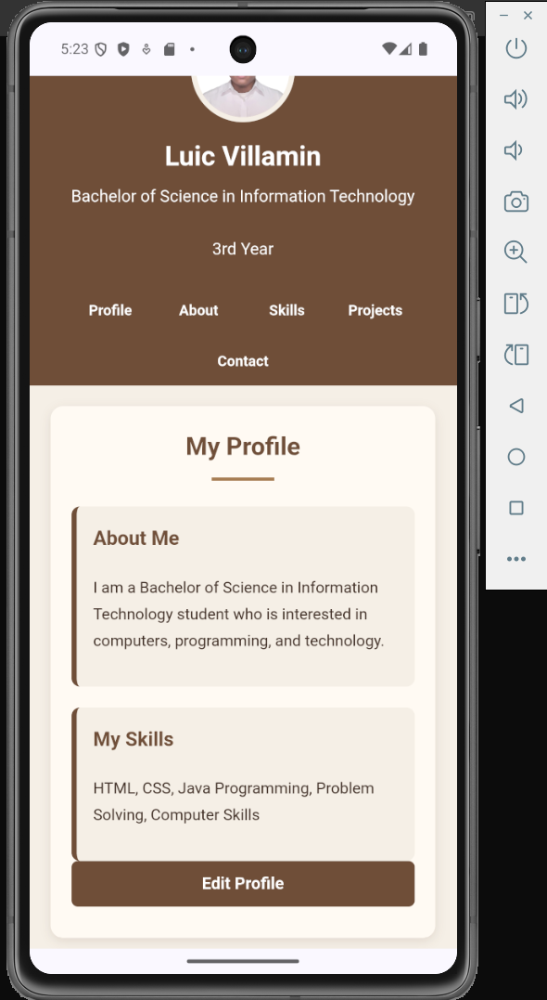

### Screenshot 2 - Edit Profile

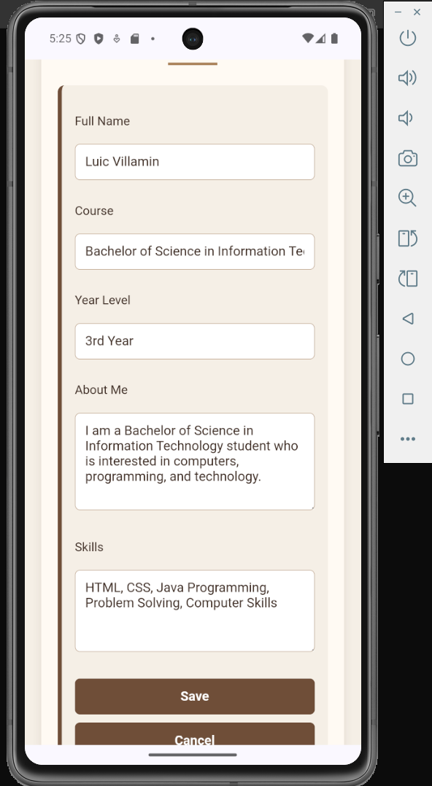

### Screenshot 3 - Updated Profile

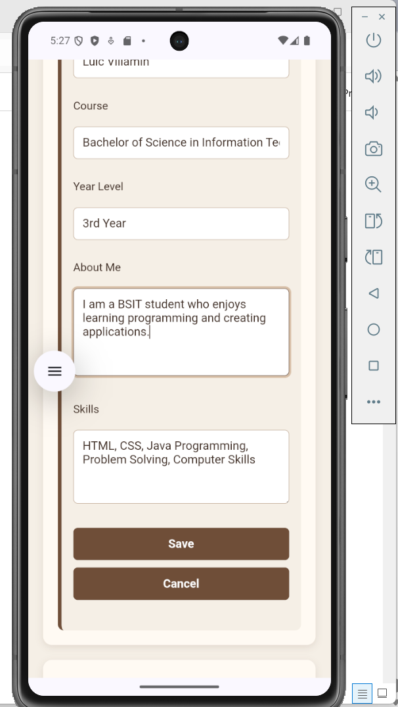

### Screenshot 4 - Updated Profile Additional View

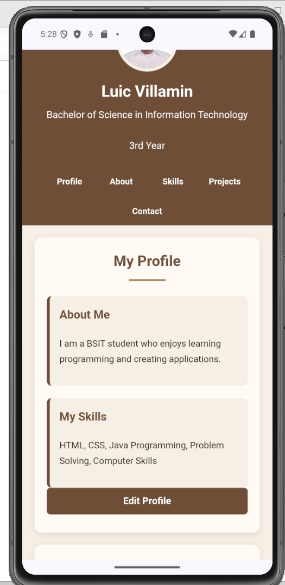

### Screenshot 5 - Contact

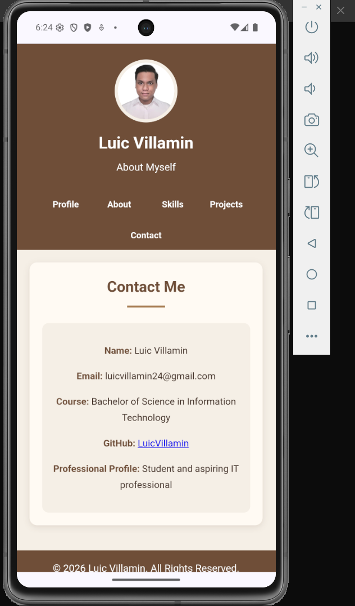

## Activity 5 - Form Validation Screenshots

### Full Name - Empty Field

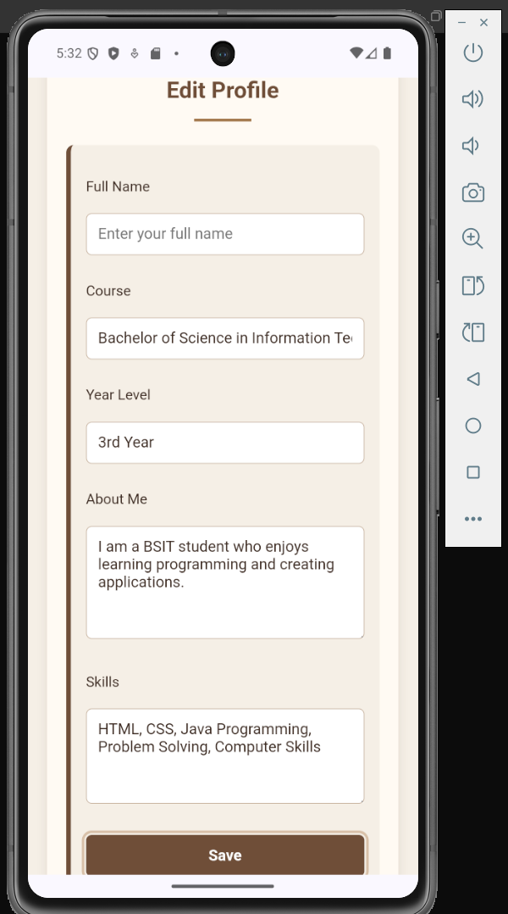

### Full Name - Validation Alert

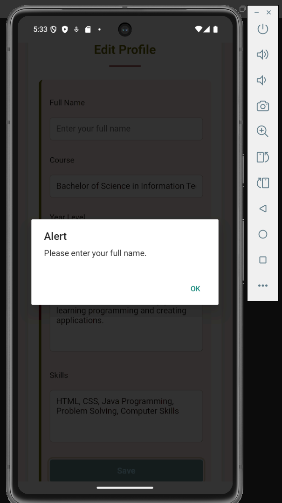

### Course - Empty Field

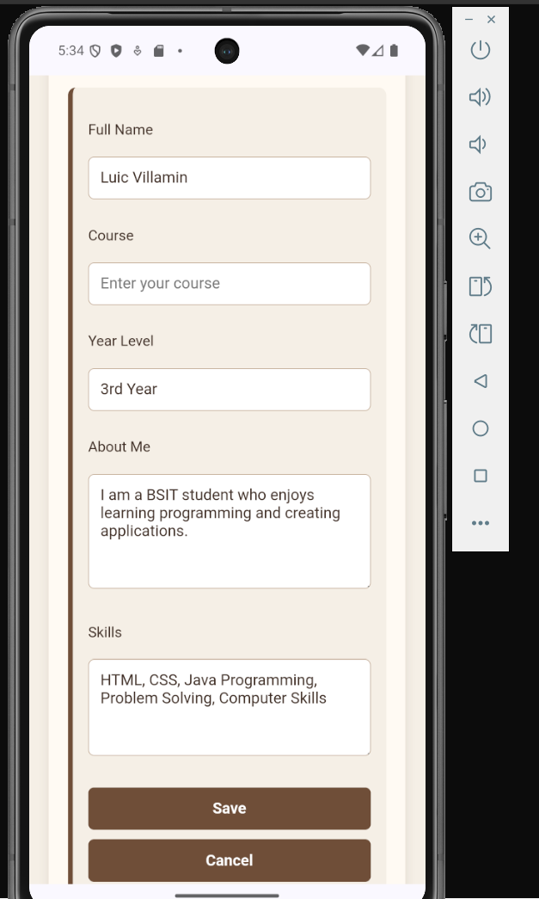

### Course - Validation Alert

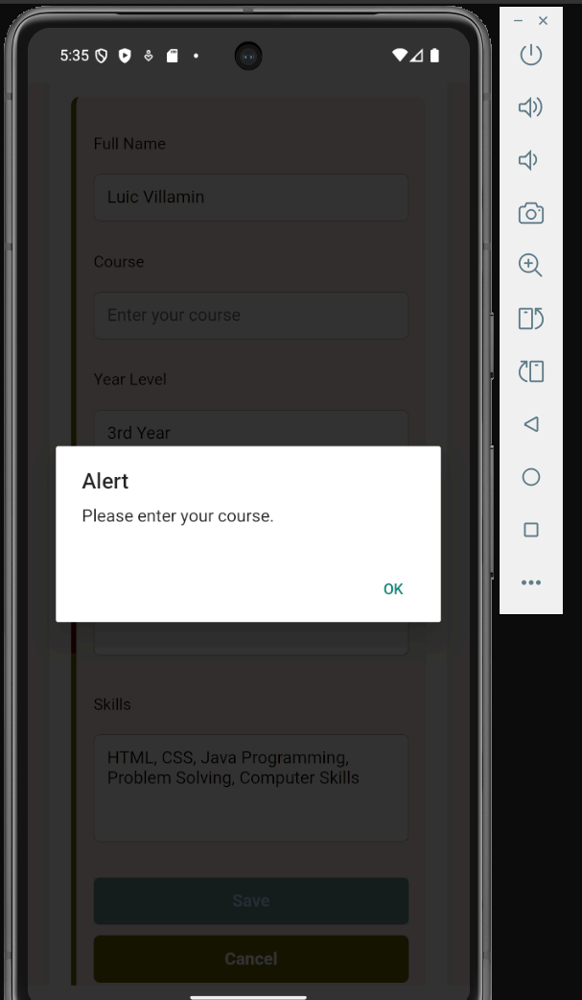

### Year Level - Empty Field

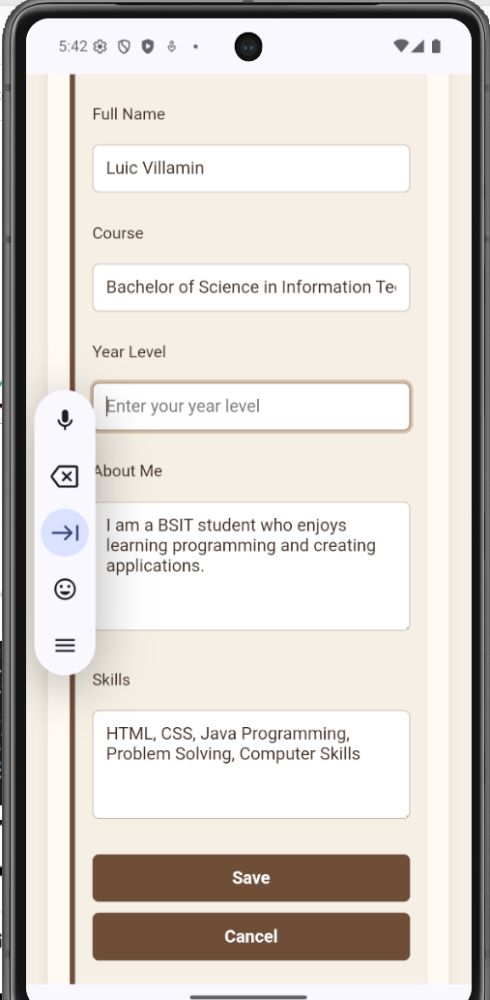

### Year Level - Validation Alert

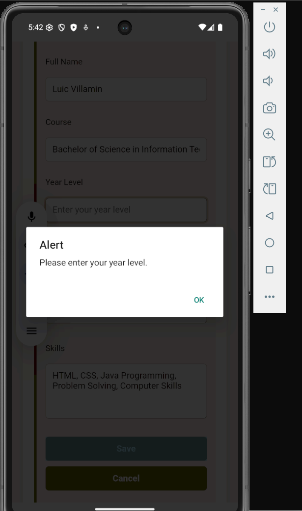

### About Me - Empty Field

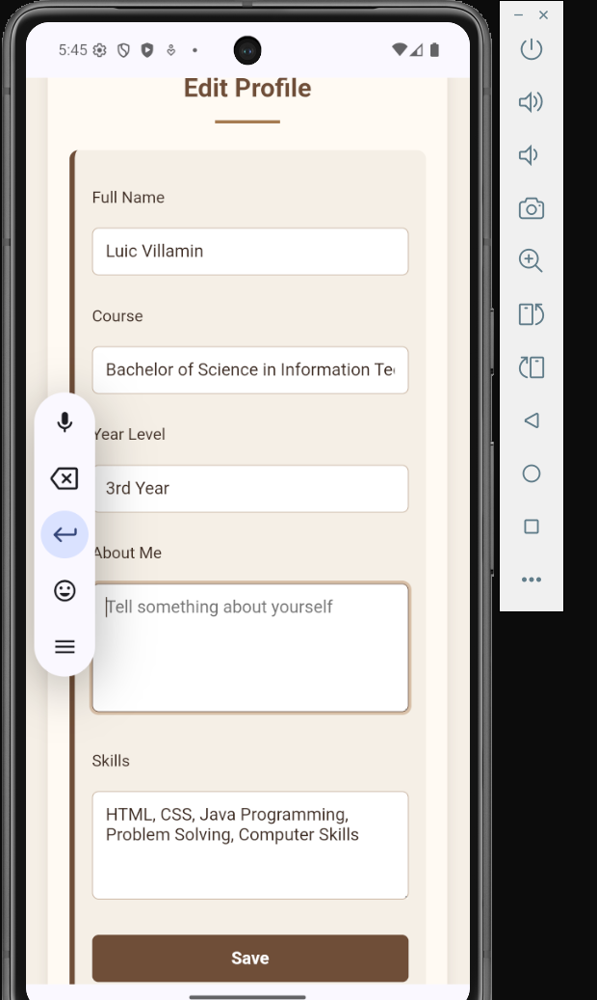

### About Me - Validation Alert

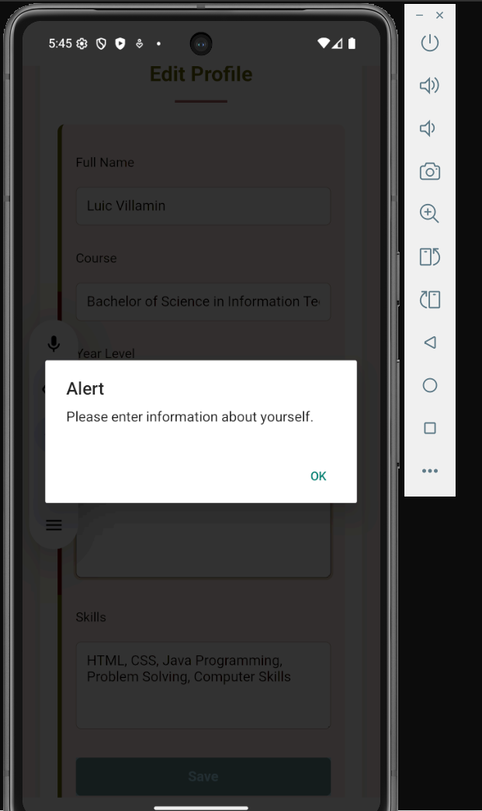

### Skills - Empty Field

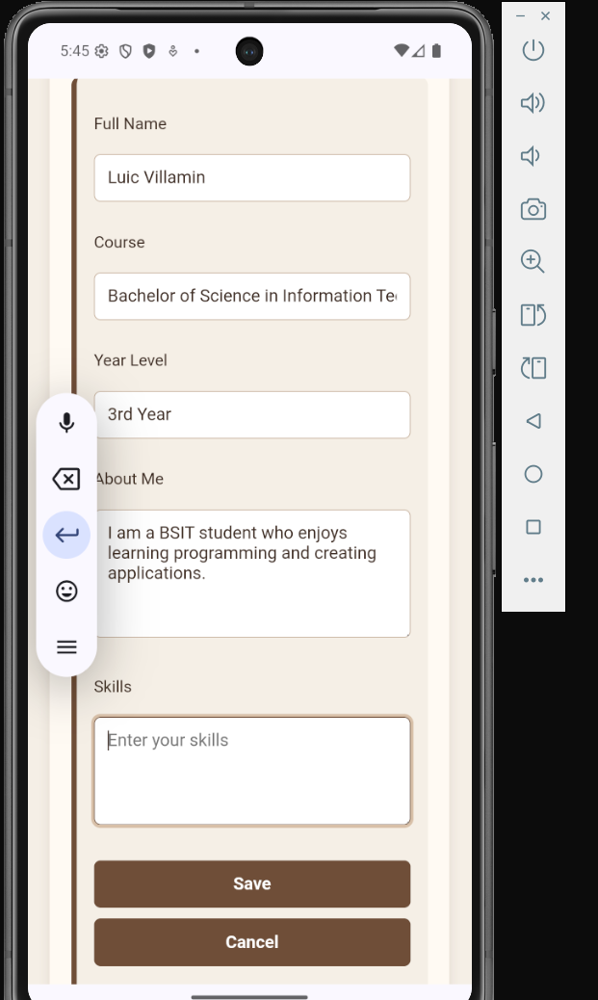

### Skills - Saved Without Alert

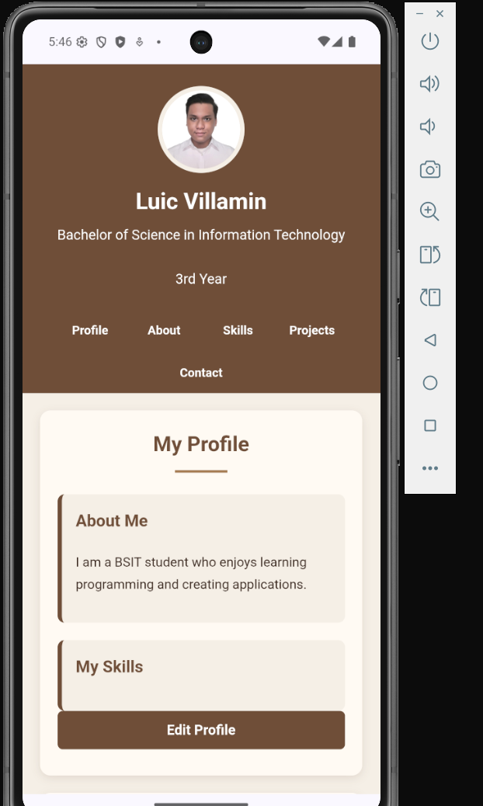

## Activity 5 - Testing

- **Test 1:** Changed Full Name, Course, Year Level, About Me, and Skills together and confirmed that all changes updated immediately.
- **Test 2:** Changed profile information and selected Cancel. The changes were discarded and the previous profile remained.
- **Test 3:** Tested empty required fields. The application prevented saving and displayed a validation message.
- **Test 4:** Saved profile changes, closed the application, and reopened it. The saved information remained through localStorage.
- **Test 5:** Performed multiple profile updates and confirmed that the latest saved information was displayed.

## Activity 5 - Conclusion

The Student Profile was improved by adding profile editing, form validation, dynamic content updates, Save and Cancel functions, and localStorage for persistent data.

The Activity 5 features were tested on an Android emulator, including editing profile information, cancelling changes, validating empty required fields, saving multiple updates, and keeping saved information after closing and reopening the application.

---

---

# Activity 6 - Profile Picture Camera Integration

## About the Project

Activity 6 continues the Activity 5 Student Profile project by adding camera integration using Apache Cordova.

The Profile page now includes a **Change Profile Picture** button. When the button is selected, the Cordova Camera plugin opens the device camera. After a photo is captured, the image is returned to the application and displayed as the new profile picture.

The existing Activity 5 features were retained, including profile editing, form validation, Save, Cancel, and localStorage for profile information.

## Camera Integration

The project uses the **Cordova Camera plugin** to access the device camera.

The camera plugin was installed using:

```text
cordova plugin add cordova-plugin-camera --save
```

The installed plugin is:

```text
cordova-plugin-camera 8.0.0
```

The plugin is required because a Cordova application uses JavaScript to communicate with native device features. The Camera plugin provides the JavaScript API needed to open the device camera and receive the captured image.

The application waits for the Cordova `deviceready` event before using the camera API.

## How the Camera Works

The camera integration follows these steps:

1. The user selects **Change Profile Picture**.
2. Cordova confirms that the device APIs are ready.
3. The application calls `navigator.camera.getPicture()`.
4. The device camera opens.
5. The user captures a photo.
6. The captured image is returned to the JavaScript code.
7. The image is converted into a displayable image source when necessary.
8. The new image is displayed in the Profile page.
9. The captured image is saved in `localStorage`.
10. The saved image is loaded again when the application is reopened.

## Image Handling and Persistence

The captured profile picture is stored in `localStorage` as an image data URL.

When a new picture is captured, the application saves the image using:

```text
localStorage.setItem("profilePicture", imageSource);
```

When the application starts, it checks for the saved profile picture and displays it if one exists.

This allows the captured profile picture to remain after closing and reopening the application.

The profile picture was tested by capturing an image, closing the application, reopening it, and confirming that the same captured image remained on the Profile page.

## Retaking and Replacing the Profile Picture

The user can select **Change Profile Picture** again to capture another image.

When another image is successfully captured, the new image replaces the previous saved profile picture.

The replacement behavior was tested successfully on the Android emulator.

## Camera Cancellation

If the user cancels the camera operation, the existing profile picture is kept.

The application displays a message informing the user that the camera was cancelled and that the current profile picture was kept.

This prevents the existing picture from being removed when the user does not want to use the new photo.

## Camera Error Handling

The camera success and error callbacks are handled in JavaScript.

If the camera operation is cancelled, the application displays an appropriate message and keeps the current profile picture.

Other camera errors are handled by displaying an error message instead of allowing the application to crash.

The camera error-handling code is included in the application, while the cancellation behavior was specifically tested on the Android emulator.

## Cordova Device API Communication

The camera feature demonstrates communication between JavaScript and a native device feature.

The application uses the Cordova Camera API:

```text
navigator.camera.getPicture()
```

JavaScript sends the camera request through the Cordova plugin. The native Android camera functionality then returns the result to the JavaScript success or error callback.

This allows the web-based Cordova application to access a device feature that is not available through normal HTML and CSS alone.

## Testing

The Activity 6 camera integration was tested using an Android emulator.

* **Test 1 - Open Camera:** The Change Profile Picture button successfully opened the camera.
* **Test 2 - Capture Photo:** A photo was successfully captured and returned to the application.
* **Test 3 - Retake Photo:** A new captured image successfully replaced the previous profile picture.
* **Test 4 - Cancel Camera:** Cancelling the camera kept the existing profile picture and displayed a cancellation message.
* **Test 5 - Restart App:** The captured profile picture remained after closing and reopening the application.
* **Test 6 - Camera Error:** Error-handling code was implemented. A separate camera-error condition could not be forced on the Android emulator, but camera cancellation and the corresponding error callback behavior were handled without crashing.
* **Test 7 - Edit Profile:** The Activity 5 Edit Profile function continued to work.
* **Test 8 - Save Profile:** Profile changes were successfully saved and displayed.
* **Test 9 - Cancel Edit Profile:** Cancelling an edit discarded the temporary changes.

## Activity 6 Screenshots

### Screenshot 1 - Student Profile

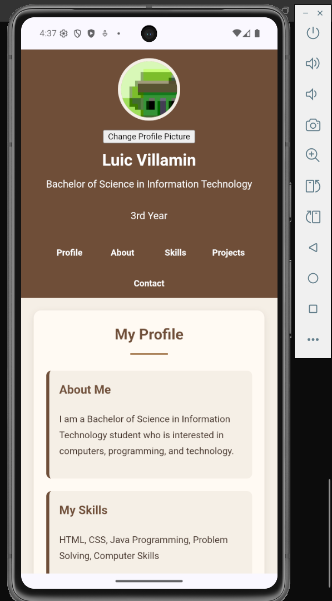

### Screenshot 2 - Change Profile Picture / Camera

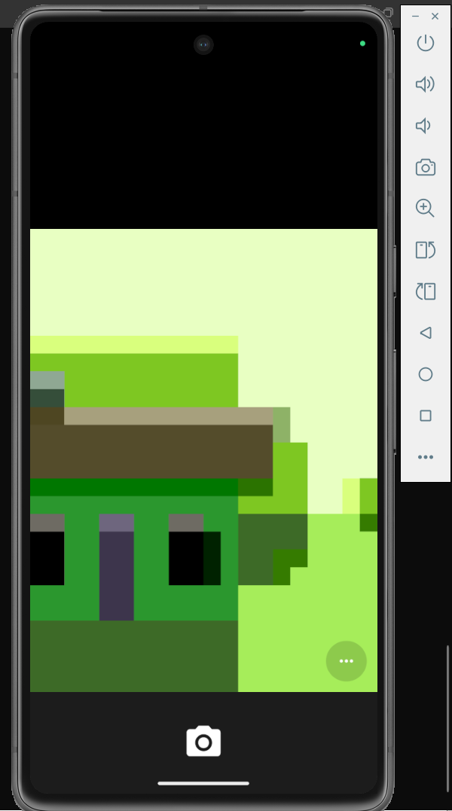

### Screenshot 3 - Captured Photo and Updated Profile

The captured-photo process and updated profile were documented using multiple screenshots showing the captured image with the confirmation button, the successful update message, and the updated profile picture.

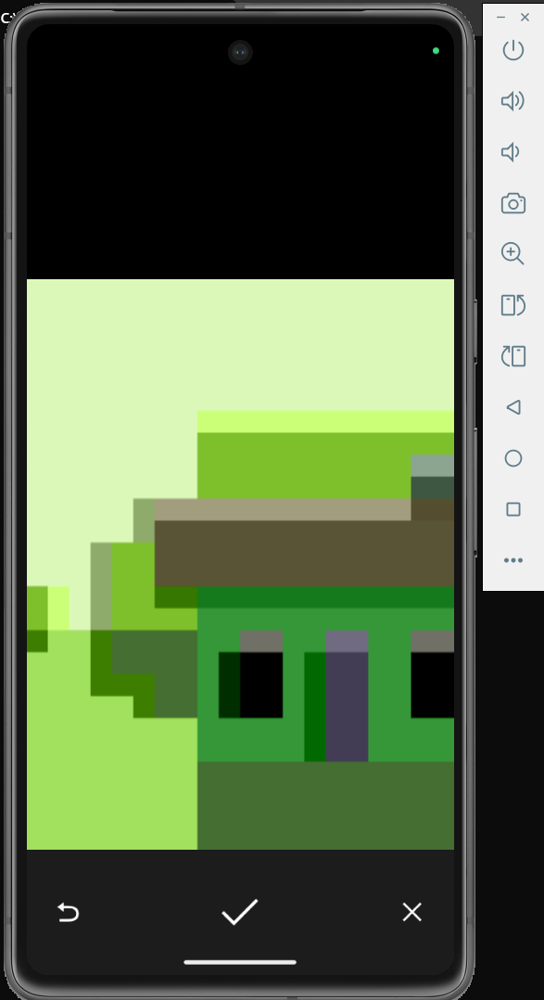

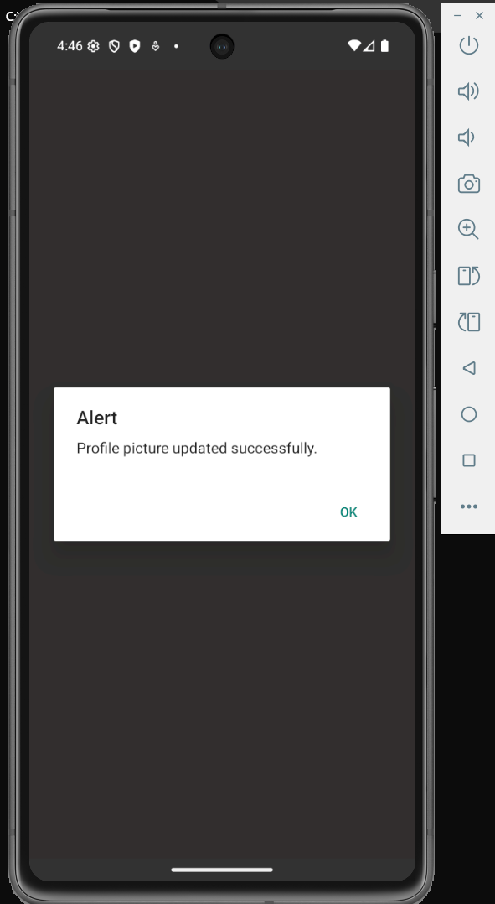

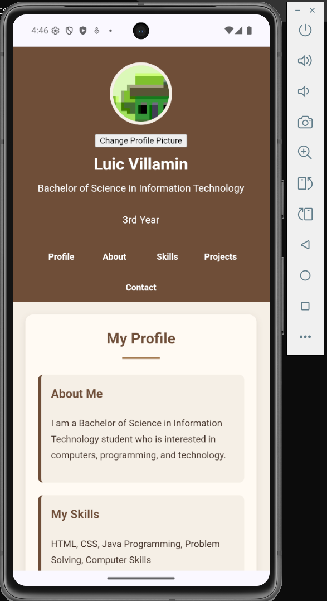


## How to Run Activity 6

### Requirements

The project requires:

* Node.js
* Apache Cordova
* Android SDK
* Java JDK
* Gradle
* Android Studio or an Android emulator
* Cordova Camera plugin

### Android Emulator

1. Open the `Villamin_Profile` project folder in Command Prompt.
2. Make sure the Cordova Camera plugin is installed.
3. Build the Android application using Apache Cordova.
4. Run the application on an Android emulator.
5. Open the Profile page.
6. Select **Change Profile Picture**.
7. Allow camera access when requested.
8. Capture a photo.
9. Confirm the photo.
10. Check that the new profile picture is displayed.
11. Close and reopen the application to verify that the picture remains saved.

## Activity 6 Conclusion

The Student Profile was improved by integrating the Android device camera using the Cordova Camera plugin.

The application can open the camera, capture a photo, display the captured image, replace the existing profile picture, handle camera cancellation, and keep the captured picture after restarting the application.

The existing Activity 5 profile editing and localStorage features were also retained and tested successfully.

---

© 2026 Luic Villamin. All Rights Reserved.