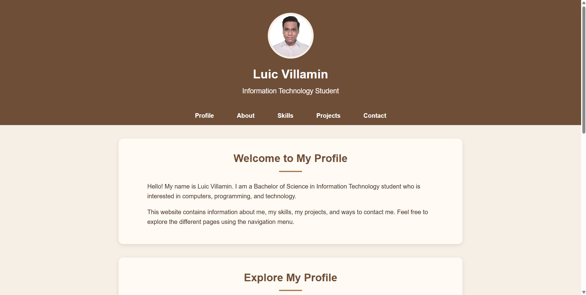
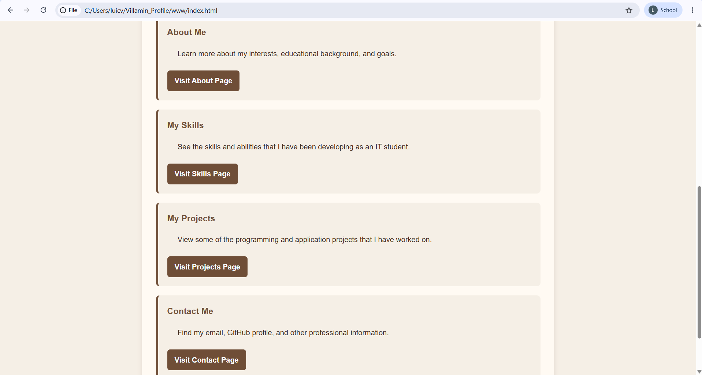
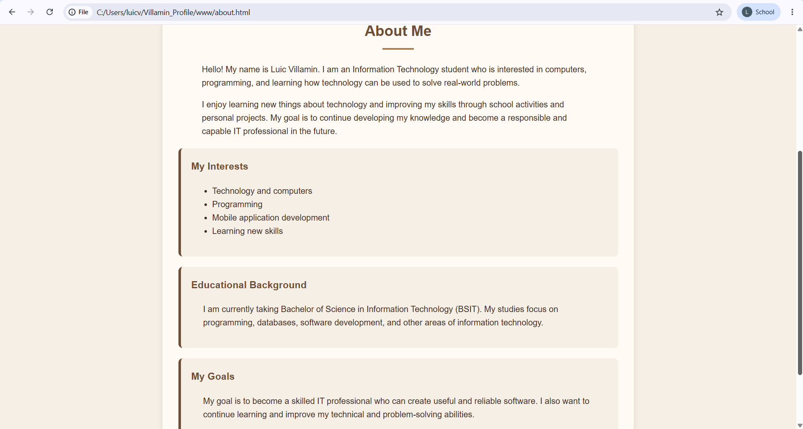
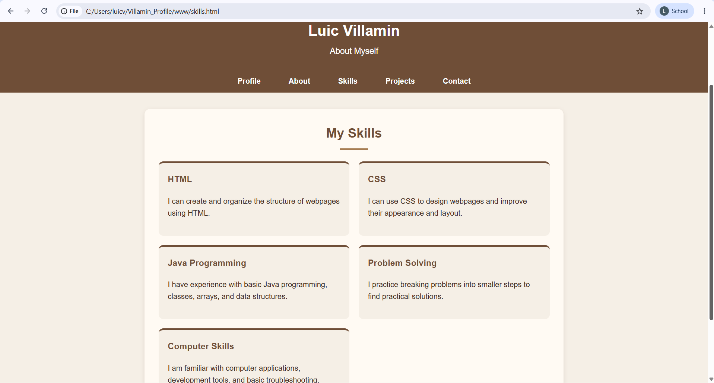
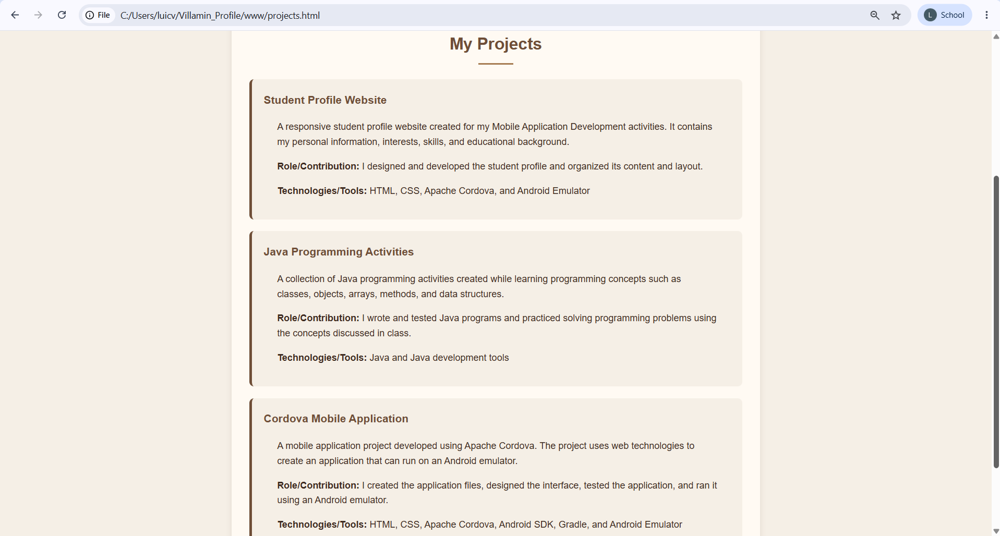
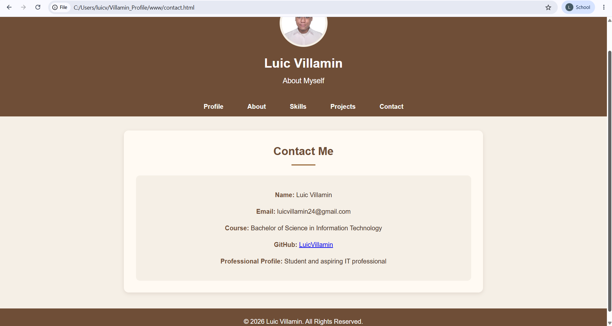

# ITCC 41 - Multi-Page Student Profile

## Activity 2

A basic student profile created using **HTML and CSS** and bundled with **Apache Cordova** for Android.

### Student Information

**Name:** Luic Villamin
**Course:** Bachelor of Science in Information Technology (BSIT)
**Subject:** ITCC 41 - Mobile Application Development
**Activity:** Activity 2 - Basic Student Profile
**Year:** 2026

---

## Activity 2 - About the Project

This project is a basic student profile developed using HTML and CSS. It contains an About section, Skills section, Contact section, navigation menu, profile picture, and footer.

The profile was bundled and compiled using Apache Cordova and successfully run using an Android emulator.

### Technologies Used

* HTML
* CSS
* Apache Cordova
* Android SDK
* Gradle
* Android Emulator

---

## Activity 2 - Student Profile Screenshots

### Screenshot 1 - Student Profile


### Screenshot 2 - About Section


### Screenshot 3 - Interests and Educational Background


### Screenshot 4 - Goals and Skills


### Screenshot 5 - Contact Section


### Screenshot 6 - Android Emulator


---

## Activity 2 - Conclusion

The Basic Student Profile was successfully created using HTML and CSS, bundled and compiled using Apache Cordova, and run successfully using an Android emulator.

© 2026 Luic Villamin. All Rights Reserved.

---

# Activity 3 - Responsive Student Profile

## About the Project

This project is an improved version of my Activity 2 Student Profile. It was redesigned using responsive web design and basic UI/UX principles to make the profile easier to view and use on desktop, tablet, and mobile screen sizes.

The profile uses HTML and CSS and is bundled with Apache Cordova for Android. The layout automatically adjusts to different screen sizes without horizontal scrolling or overlapping content.

## Responsive Design Techniques

The following responsive design techniques were used:

* Flexible section widths using percentages and a maximum width.
* CSS media queries for tablet and mobile screen sizes.
* Responsive typography using `clamp()`.
* Responsive spacing and padding using `clamp()`.
* A flexible navigation menu that can wrap on smaller screens.
* A responsive skill grid that changes from two columns to one column on mobile.
* Responsive images that do not exceed their container width.
* Text wrapping to prevent long content from causing horizontal scrolling.

## UI/UX Principles

The profile was designed with the following UI/UX principles:

* **Consistency:** Colors, card styles, spacing, and typography are kept consistent throughout the page.
* **Visual Hierarchy:** Headings, profile information, sections, and cards are organized to make important information easy to notice.
* **Accessibility:** Navigation links have clear focus styles, and navigation buttons have comfortable touch targets.
* **Readability:** Appropriate font sizes, line spacing, and content widths are used to make the text easier to read.
* **Responsive Design:** The layout adapts to desktop, tablet, and mobile screen sizes.
* **Usability:** The navigation links allow users to quickly move between the different sections of the profile.

## Navigation

The profile uses HTML anchor links to navigate between sections of the profile.

The navigation was created using HTML anchor links and does not require JavaScript.

## Project Structure

```text
Villamin_Profile/
├── www/
│   ├── css/
│   │   └── index.css
│   ├── img/
│   │   ├── IDPhoto_20210719_005457 (1)-Photoroom.png-Photoroom.png
│   │   └── logo.png
│   ├── js/
│   └── index.html
├── screenshots/
├── config.xml
├── package.json
└── README.md
```

## How to Run

1. Open the project folder in a code editor such as Notepad++ or Visual Studio Code.
2. Open `www/index.html` in a web browser to view the responsive student profile.
3. For the Android version, use Apache Cordova to build and run the project on an Android emulator or compatible device.

## Activity 3 Screenshots

The following screenshots show the responsive Student Profile on desktop, laptop, tablet, and mobile screen sizes.

### Screenshot 1 - Desktop View


### Screenshot 2 - Laptop View (1024px)


### Screenshot 3 - Mobile View (320px)


### Screenshot 4 - Mobile View (425px)


### Screenshot 5 - Tablet View (768px)


---

## Activity 3 - Conclusion

The Student Profile was improved using responsive web design and UI/UX principles. The layout was tested on desktop, laptop, tablet, and mobile screen sizes to ensure that the content remains readable, usable, and properly arranged without horizontal scrolling or overlapping elements.

---

# Activity 4 - Multi-Page Student Profile

## About the Project

Activity 4 continues the existing Student Profile project by converting it into a multi-page website. The project contains five separate HTML pages that provide information about me, my skills, my projects, and my contact information.

The project continues to use **HTML and CSS** and is bundled with **Apache Cordova** so that it can run on an Android emulator.

## Application Pages

The Student Profile contains five pages:

### 1. Profile

The Profile page is the homepage of the application. It contains my profile picture, complete name, short introduction, brief description, and navigation links to the other pages.

### 2. About

The About page provides information about me, including my personal introduction, interests, educational background, and goals.

### 3. Skills

The Skills page lists my skills and provides a short description of each skill.

The five skills included are:

* HTML
* CSS
* Java Programming
* Problem Solving
* Computer Skills

### 4. Projects

The Projects page presents three projects and activities:

* **Student Profile Website**
* **Java Programming Activities**
* **Cordova Mobile Application**

Each project includes a short description, my role or contribution, and the technologies or tools used.

### 5. Contact

The Contact page provides my name, email address, course, GitHub profile, and professional profile information.

## Navigation

The application uses normal HTML anchor links to connect the five separate pages.

The navigation menu is available consistently across the pages:

* `index.html` - Profile
* `about.html` - About
* `skills.html` - Skills
* `projects.html` - Projects
* `contact.html` - Contact

Users can move between Profile, About, Skills, Projects, and Contact without using JavaScript.

Each page also provides an easy way to return to the Profile homepage through the navigation menu.

## Responsive Design

The five pages were tested on different screen sizes to make sure that the layout remains readable and usable.

The pages were tested using the following screen sizes:

* 1440 × 1060 - Laptop L
* 1024 × 918 - Laptop
* 768 × 689 - Tablet
* 425 × 689 - Mobile L
* 375 × 689 - Mobile M
* 320 × 689 - Mobile S

The Profile, About, Skills, Projects, and Contact pages were checked at these screen sizes.

The responsive design prevents horizontal scrolling, overlapping content, cut-off text, and distorted images.

## UI/UX Principles

The Activity 4 Student Profile applies the following UI/UX principles:

* **Consistency:** The pages use the same colors, typography, navigation style, spacing, and visual design.
* **Visual Hierarchy:** Headings, sections, cards, and important information are organized clearly.
* **Readability:** Text sizes, spacing, and content widths are designed to make information easy to read.
* **Accessibility:** Navigation links have clear focus styles, readable text, good contrast, and comfortable touch targets.
* **Usability:** Users can easily understand where they are and navigate to the other pages.
* **Responsive Design:** The layout adapts to desktop, tablet, and mobile screen sizes.
* **Simple Navigation:** HTML links are used instead of JavaScript for page navigation.

## Technologies and Tools

The project uses:

* HTML
* CSS
* Apache Cordova
* Android SDK
* Gradle
* Android Emulator

## Project Structure

```text
Villamin_Profile/
├── www/
│   ├── css/
│   │   └── index.css
│   ├── img/
│   │   ├── IDPhoto_20210719_005457 (1)-Photoroom.png-Photoroom.png
│   │   └── logo.png
│   ├── js/
│   ├── index.html
│   ├── about.html
│   ├── skills.html
│   ├── projects.html
│   ├── contact.html
│   └── index_activity3_backup.html
├── screenshots/
├── config.xml
├── package.json
└── README.md
```

## How to Run Activity 4

### Web Browser

1. Open the `Villamin_Profile` project folder.
2. Open the `www` folder.
3. Open `index.html` in a web browser.
4. Use the navigation menu to open the About, Skills, Projects, and Contact pages.

### Android Emulator

1. Open the project folder in Command Prompt.
2. Build the Android application using Apache Cordova.
3. Run the application on an Android emulator.
4. Open the Profile page and use the navigation menu to test all five pages.

The project was successfully built and run using an Android emulator.

## Activity 4 Screenshots

The following screenshots show the five pages of the Activity 4 Multi-Page Student Profile.

### Screenshot 1 - Profile



### Screenshot 2 - Profile Additional View



### Screenshot 3 - About



### Screenshot 4 - Skills



### Screenshot 5 - Projects



### Screenshot 6 - Contact




---

## Activity 4 - Conclusion

The Student Profile was successfully converted into a multi-page application containing Profile, About, Skills, Projects, and Contact pages.

The five pages use consistent navigation and UI/UX design. The application was tested on desktop, tablet, and mobile screen sizes and successfully built, installed, and launched using Apache Cordova on an Android emulator.

© 2026 Luic Villamin. All Rights Reserved.
